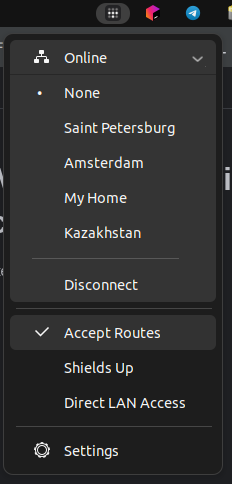
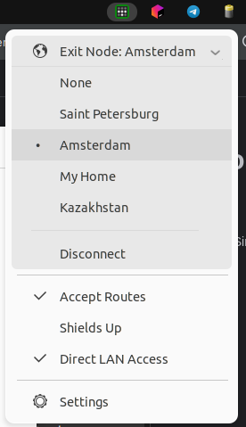
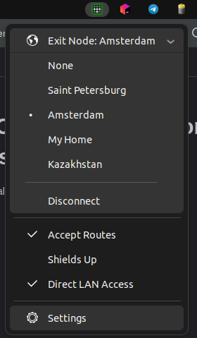
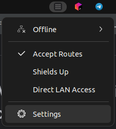

# GNOME shell extension Tailscale Connect

Graphical interface for the [Tailscale](https://tailscale.com/) desktop client. Simple, faster, configurable.

## Disclaimer

I try to update the code to fit my system. Since I constantly use this extension myself. In the future, I will implement support for newer versions of Gnome Shell.

## Features

- Authorization in Login Server
- Connect/Disconnect and using exit-nodes without root access 
- On/Off Accept routes
- On/Off Block incoming connections (Shields-up)
- On/Off Direct lan access
